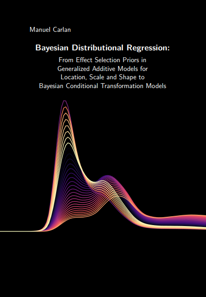

<table border="0">
 <tr>
    <td><b style="font-size:30px"></b></td>
    <td><b style="font-size:30px"></b></td>
 </tr>
 <tr>
    <td>
Education
======
* Ph.D in Applied Statistics - Thesis about Bayesian Modeling, 2021
* M.Sc. in Applied Statistics,  University of Göttingen, 2016
* B.A. in Economics & Philosophy, University of Göttingen & Seoul National Unversity, 2014
   
Work experience
======
* 2020 - 2021: Postdoctoral Researcher
  * University of Göttingen
  * Duties included: 

* 2016 - 2020: Research Assistant
  * University of Göttingen
  * Duties included: 
  * Supervisor: Professor Thomas Kneib

* 2014 - 2016: Student Research Assistant
  * University of Göttingen
  * Duties included: Supporting development of statistical software [BayesX](https://www.uni-goettingen.de/de/what+is+bayesx/550520.html)
  * Supervisor: Professor Nadja Klein
  
* 2013: Intern
  * Institute of Employment Research / Research Data Centre
  * Duties: Supporting record linkage process via Stata/R/KNIME
  

Technical Skills
======
* R
* Python
* Stan

Publications
======
  <ul>
    
  </ul>
  
Talks
======
  <ul>
    
  </ul>
  
Teaching
======
  <ul>
    
  </ul>
</td>
    <td>
    \
    \
    \
    \
    \
    \
    \
    \
    \
    \
    \
    </td>
 </tr>
</table>

  

