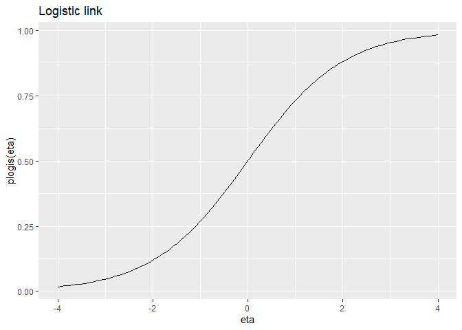
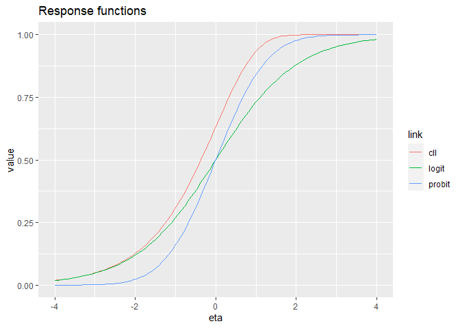
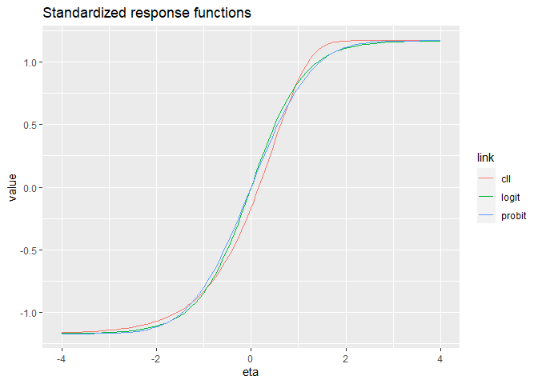

# 1. Introduction - Roadmap for this semester

------------------------------------------------------------------------

What are Generalized Linear Models? Generalizations of the linear
model,Duh!

Linear Model *y* = **x**<sup>′</sup>**β** + *ϵ*, *ϵ* ∼ ℕ(0, 1)

What are we doing here?

-   Explain *y* as a function of **x**.
-   Assume a distribution for *y*, conditional on **x** (Gaussian)
-   The role of **x** is to model the mean of the resulting Gaussian,
    i.e. *y* ∼ ℕ(*μ*(**x**), *σ*<sup>2</sup>), where
    e.g. *μ*(**x**) = **x**<sup>′</sup>**β**

What do we want to do in this course in the upcoming few months?

*Relax assumption that*

1.  *y* is conditionally Gaussian. (Ch. 2, 3)
2.  *x* only affects the mean of *y* (explicitly in Ch. 4, but remember
    in case of e.g. Poisson distribution 𝔼 = 𝕍𝕒𝕣 = *λ*, which is the
    parameter we model).
3.  Influence is linear in *x* (Ch. 5, leave the realm of GLMs and open
    up tp GAMs and STAR).

Mixed models (Ch.6) tackle the correlation structure (think of repeated
measurements) and Duration time analysis (Ch.7) comes with a very
different way of looking at a model. This will become clear in the end.

------------------------------------------------------------------------

# 2. GLM for non-normal responses

## Binary models


**Binary regression is classification!**

### Linear probability model

$$
\\begin{aligned}
y_i =0 &\\rightarrow \\epsilon_i = y_i - x_i^\\prime \\beta = - x_i^\\prime \\beta\\\\
y_i =1 &\\rightarrow \\epsilon_i = 1- x_i^\\prime\\beta\\\\
\\end{aligned}
$$
 → *ϵ*<sub>*i*</sub> is discrete

*x*<sub>*i*</sub><sup>′</sup>*β* ∈ ℝ → *ŷ*<sub>*i*</sub> = *x*<sub>*i*</sub><sup>′</sup>*β̂* ∈ ℝ

In a GLM:

$$
\\begin{aligned}
E(y_i) &= 1 \\cdot P(y_i=1) + 0\\cdot P(y_i=0) \\\\
       &= P(y_i = 1) = \\pi_i
\\end{aligned}
$$
→ Model is continuous.

$$
\\begin{aligned}
h: \\mathbb{R} &\\rightarrow \[0,1\]\\\\
   x_i^\\prime \\beta &\\rightarrow \\pi_i = h(x_i^\\prime \\beta)
\\end{aligned}
$$

------------------------------------------------------------------------

### Link/response functions

Logistic link:
$$
\\begin{aligned}
h(\\eta) &= \\frac{\\exp(\\log(\\frac{\\pi}{1-\\pi}))}{1+ \\exp(\\log(\\frac{\\pi}{1-\\pi\]}))} \\\\
&= \\frac{\\frac{\\pi}{1-\\pi}}{\\frac{1-\\pi +\\pi}{1-\\pi}} = \\frac{\\pi}{1} = \\pi
\\end{aligned}
$$

``` r
eta <- seq(-4, 4, length=100)
qplot(eta, plogis(eta), geom="line",  main="Logistic link")
```



Important concept and easy to be confused about: **odds** :
$\\frac{\\pi}{1-\\pi}= \\frac{\\text{success prob.}}{\\text{failure prob.}}$

If odds

-    = 1 → success and failure equally likely
-    \> 1 → success more likely than failure
-    \< 1 → success less likely than failure

**Interpretation relative:** *x*<sub>*j* + 1</sub>/*x*<sub>*j*</sub> (to
enable comparison)

$$
\\frac{\\frac{\\pi(x\_{j}+1)}{1-\\pi(x\_{j}+1)}}{\\frac{\\pi(x\_{j})}{1-\\pi(x\_{j})}} = \\exp(\\beta_j)
$$

------------------------------------------------------------------------

### Response functions

All response functions are cumulative distribution functions (cdfs).

``` r
eta <- seq(-4, 4, length=100)

pcll <- function(x) 1-exp(-exp(x))

ggdat <-tibble("eta"=eta, "logit"=plogis(eta), "probit"=pnorm(eta), "cll"=pcll(eta) )
ggdat %>% pivot_longer(c("logit", "probit", "cll"), names_to="link") %>% 
  ggplot + geom_line(aes(x=eta, y=value, colour=link)) + ggtitle("Response functions")
```



Because *h* are cdfs, naturally there is an associatted distribution
(with expectation and variance).

-   **logistic**:
    $\\mathrm{E}(x) = 0, \\mathrm{Var}(x) = \\frac{\\pi^2}{3}$
-   **probit**: *E*(*x*) = 0, *V**a**r*(*x*) = 1
-   **cloglog**:
    $\\mathrm{E}(x) = -0.5772, \\mathrm{Var}(x) = \\frac{\\pi^2}{6}$

You can always standardize the links/effects to make them comparable.

``` r
eta <- seq(-4, 4, length=100)

ggdat <-tibble("eta"=eta, "logit"=plogis(eta*pi/sqrt(3)), "probit"=pnorm(eta), "cll"=1-exp(-exp(eta*pi/sqrt(6)-0.5772)) )
ggdat %>% pivot_longer(c("logit", "probit", "cll"), names_to="link") %>% mutate(value = scale(value)) %>%
  ggplot + geom_line(aes(x=eta, y=value, colour=link)) + ggtitle("Standardized response functions")
```



-   differences in link functions can be canceled to a large extent by
    linear operations in the predictor (linear operation on the scale of
    the predictor lead to nonlinear transformation on the scale of *h*!
    (as cdfs are nonlinear with very few exceptions (𝕌))
-   since a (GLM) does exactly that, influence of link functions is
    smaller than on the first glance

------------------------------------------------------------------------

### Latent utility model

Why do we do this? It is just the general approach towards binary
response models. Think the other way round: we started with links and
stated later that they are cdfs. Now, we derive that they are cdfs
(through *ϵ*) and then think about what kind of links they could
represent. <!-- Binary responses $y_i \in \{0,1\}$ -->
<!-- Utility differences $\tilde{y}_i = \boldsymbol{x}_i^\prime \boldsymbol{\beta} + \epsilon_{i}$ -->
<!--  $$ --> <!-- \begin{aligned} -->
<!--  P(y_i = 1) &= P(\text{"differences in utilities is positive"})  \\ -->
<!--  &= P(\tilde{y}_i >0) \\ -->
<!--  &= P(\boldsymbol{x}^\prime_i + \epsilon_i >0) -->
<!-- \end{aligned} --> <!-- $$ -->
$$
\\begin{aligned}
P(y_i = 1) &= P(\\tilde{y}\_i \>0) \\\\
&= 1- P(\\tilde{y}\_i \\leq 0) \\\\
& = 1-P(\\boldsymbol{x}\_i^\\prime \\boldsymbol{\\beta} + \\epsilon \\leq 0)\\\\
& = 1- P(\\epsilon_i \\leq - \\boldsymbol x_i^\\prime \\boldsymbol \\beta) \\\\
&= 1- h(-\\boldsymbol{x}\_i^\\prime \\boldsymbol \\beta)\\\\
&= h(\\boldsymbol {x}\_i^\\prime \\boldsymbol \\beta)
\\end{aligned}
$$

→ *h* corresponds to a symmetric distribution function *F* (e.g. logit,
probit), if *F*(*η*) = 1 − *F*( − *η*) and we can write the model in the
general form *π* = *F*(*η*) and *η* = *F*<sup> − 1</sup>(*π*).

If assymmetric (e.g cloglog): *η* =  − *F*<sup> − 1</sup>(1 − *π*).

------------------------------------------------------------------------

### Interpretation of parameters in the logit model

The influence of the explanatory variables on the probability
*π* = *P*(*y* = 1) is nonlinear and quite obscure. **Direct
interpretability only via the signs of *β*** ,i.e. if *β* \> 0, then *π*
increases and vice versa. We need the odds ratio for more exact
interpretations.

Don’t be confused:

-   “success” probability *π* = *P*(*y* = 1), “failure” proability
    1 − *π* = *P*(*y* = 0)
-   **odds** are defined as the “success” probability divided by the
    “failure” probability: $\\frac{\\pi}{1-\\pi}$, e.g. if the chance of
    me winning a game is *π* = 0.75 and the chance of losing is
    1 − *π* = 0.25, then the odds are 0.75/0.25 = 3 to 1 that I will win
    the game. Therefore, note that **odds are no probabilities**, but a
    ratio of “successes” divided by the “failures” (you get a
    probability by dividing by “failures” + “successes”). Odds follow a
    multiplicative model
    $\\frac{\\pi}{1-\\pi} = \\exp(\\beta_0)\\exp(x_1\\beta_1)...$
-   **odds ratio** is a ratio of odds and since odds are ratios, odds
    ratios are ratios of ratios (sorry). **odds ratios are different
    from odds** and can help interpreting regression coefficients,
    because they “isolate” their respective impact. Thus, they indicate
    relationships between two different configurations, e.g. odds of
    being sick with treatment (*x* = 1) vs. odds of being sick without
    treatment (*x* = 0) → compare with slide 41/box 5.2from regression
    book.

$$
\\begin{aligned}
\\text{Odds ratio} &= \\frac{\\text{odds}\_{\\text{treatment}}}{\\text{odds}\_{\\text{no treatment}}} = \\frac{\\frac{P(\\text{sick}\|\\text{treatment})}{P(\\text{not sick}\|\\text{treatment})}}{\\frac{P(\\text{sick}\| \\text{no treatment})}{P(\\text{not sick}\|\\text{no treatment})}} = \\exp(\\beta) \\\\
\\end{aligned}
$$
The odds ratio of variable *x* ∈ {1 = treatment, 0 = no treatment} is
the respective change in odds, when variable *x* changes (increases
from, if *x* is cont.) 0 to 1:
$$
\\begin{aligned}
\\text{odds}\_{\\text{treatment}} = \\exp(\\beta)\\cdot \\text{odds}\_{\\text{no treatment}}
\\end{aligned}
$$
This would still hold if there were other covariables as their impact
would cancel in this ratio.

### Grouped data

$$
\\begin{aligned}
y_g \\sim \\text{Bin}(\\pi_g, n_g) \\rightarrow &\\mathrm{E}(y_g) = n_g \\pi_g \\\\  
                                          &\\mathrm{Var}(y_g) = n_g \\pi_g (1-\\pi_g)\\\\
\\bar{y}\_g \\sim \\text{Bin}(\\pi_g, n_g)/n_g \\rightarrow & \\mathrm{E}({y}\_g / n_g) = \\pi_g\\\\
                                                    &\\mathrm{Var}(\\bar{y}\_g) = \\mathrm{Var}({y_g /n_g}) =\\mathrm{Var}({y_g})/n_g^{2} = n_g/n_g^2 \\pi_g (1-\\pi_g)=\\pi_g    (1-\\pi_g)/n_g
\\end{aligned}
$$

### Overdispersion

Dispersion means variability and refers to variance. Overdispersion is a
situation, where the empirical variance exceeds the “theoretical”
variance that is expected from the model. Happens very often. Becomes
clearer with count regression.

How do positively correlated observations lead to overdispersion? In few
words: because the independence assumption inherent in binomially
distributed rvs is not given anymore. Let
*Y*<sub>*i*</sub> ∼ *B**e**r*(*π*), then, if *Y*<sub>*i*</sub> are
independent

However, if there is correlation, the variance of a sum isn’t the sum of
the variances anymore,
i.e. $\\mathbb{Var}(\\sum\_{i=1}^n Y_i) \\neq \\sum\_{i=1}^n \\mathbb{Var}(Y_i)$
which was used in eq. 1
($\\sum\_{i=1}^n \\mathbb{Var}({Y_i}) =\\sum\_{i=1}^n \\pi(1-\\pi) = n\\pi(1-\\pi)$
)

For correlated obs.
*C**o**r**r*(*Y*<sub>*i*</sub>, *Y*<sub>*j*</sub>) = *ρ* \> 0
expectation is the same (invariant) 𝔼 = *n**π*, but the variance becomes
$$
\\mathbb{Var}(Y)=\\mathbb{Var}(\\sum\_{i=1}^n Y_i) = n\\pi(1-\\pi)(1 + \\rho(n-1))
$$
which is certainly  \> *n**π*(1 − *π*), the variance we would expect
under the binomial model. (*ρ* \< 0 would lead to underdispersion). Does
the left term look familiar, maybe to the scaling factor *ϕ* on slide
49? Take a look at
<https://en.wikipedia.org/wiki/Variance#Sum_of_correlated_variables> if
you want and try to derive it from there (just plug in our 𝕍𝕒𝕣 for
*σ*<sup>2</sup>) Think of overdispersion not simply of “too much
variance”. It means more variance than expected. There is a difference!

### Maximum Likelihood for binary GLM

Log-likelihood
$$
\\begin{aligned}
l(\\boldsymbol{\\beta}) &= \\log(L(\\boldsymbol{\\beta} \\beta))\\\\
&= \\sum\_{i=1}^{n}l_i(\\boldsymbol{\\beta})\\\\
&= \\sum\_{i=1}^{n}y_i \\log(\\pi_i) + (1-y_i)\\log(1-\\pi_i)
\\end{aligned}
$$
“Score contribution” (returns vector of length of **β**)

$$
\\begin{aligned}
\\boldsymbol{s}\_i(\\boldsymbol{\\beta}) &= \\frac{\\partial}{\\partial \\boldsymbol{\\beta}} l_i (\\boldsymbol{\\beta})\\\\
&= \\frac{\\partial}{\\partial \\boldsymbol{\\beta}} \\frac{\\partial \\eta_i}{\\partial \\eta_i} \\frac{\\partial \\pi_i}{\\partial \\pi_i} l_i(\\boldsymbol{\\beta}) \\text{   (chain rule)}\\\\
&= \\frac{\\partial \\eta_i}{\\partial \\boldsymbol{\\beta}} \\frac{\\partial \\pi_i}{\\partial \\eta_i} \\frac{\\partial}{\\pi_i} l_i(\\boldsymbol{\\beta})
\\end{aligned}
$$
Score function is the sum of score contributions (as with the
log-likelihood)
$$
\\begin{aligned}
\\boldsymbol{s}(\\boldsymbol{\\beta}) = \\sum\_{i=1}^{n}\\boldsymbol{s}\_i(\\boldsymbol{\\beta})
\\end{aligned}
$$

Newton-Raphson


## Count regression


In general, similar issues with **x**<sub>*i*</sub><sup>′</sup>**β** as
before (not discrete and positivity not guaranteed), i.e.

-   *y*<sub>*i*</sub> discrete but
    **x**<sub>*i*</sub><sup>′</sup>**β** continuous.
-   *y*<sub>*i*</sub> ≥ 0 but **x**<sub>*i*</sub><sup>′</sup>**β** ∈ ℝ

Why not try a similar idea as in logistic regression? That is, assume a
distribution for *y*<sub>*i*</sub> and model
*E*(*y*<sub>*i*</sub>) = *h*(**x**<sub>*i*</sub><sup>′</sup>**β**). This
idea, i.e. assuming a distribution for *y*<sub>*i*</sub> and model the
respective parameter(s) by transforming a linear predictor
**x**<sub>*i*</sub><sup>′</sup>**β** such that it fulfills the
respective properties (e.g. positivity for *λ* or {0,1} for *π* etc.) is
applied to many problems in GLMs.

## Log-Normal model

What kind of random variable is log-normal distributed? An rv that is
normal, when logarithmized. Note that
*E*(*y*<sub>*i*</sub>) ≠ exp (*E*(*ỹ*<sub>*i*</sub>)),  where *ỹ*<sub>*i*</sub> = log (*y*<sub>*i*</sub>)
In other words, this can result in (sometimes huge) bias! Furthermore,
this means that the log-normal model is not a GLM in definition of the
next section!

   

## Generalized Linear Models

**Exponential family** Why is it important? Because if we can show that
a response distribution belongs to the exponential family, we
immediately know its inferential properties and can present it in a
unified framework. Probably most of the distributions you have worked
with so far belong to the exponential family.


(Fahrmeir, Ludwig, et al. “Regression models.” Regression. Springer,
Berlin, Heidelberg, 2013. 303) **Table shows the canonical links!**

-   *θ* is called the canonical parameter; think of what we do here:
    1.  specify linear predictor *η* = **x**<sup>′</sup>**β** to model
        the expectation *μ* via the link function *g*:
        *μ* = *g*<sup> − 1</sup>(*η*) or *g*(*μ*) = *η*

    2.  often *μ* cannot be  = **x**<sup>′</sup>**β**,but requires to be
        positive, between zero and one etc. so, we need to transform *η*
        in a function *μ*(**x**)

    3.  *θ* is defined on the scale of *y* and needs to be retransformed
        via *θ* = (*b*<sup>′</sup>)<sup> − 1</sup>(*μ*) see below;  

        **If the link function relates *θ*, *μ* and *η* such that
        *η* = *θ*, we call it the canonical link, given by
        *g* = (*b*<sup>′</sup>)<sup> − 1</sup>**. *b* is related to the
        distribution and governs what is canonical.  
-   every exponential family member has a canonical link function,
    resulting in
    *θ*<sub>*i*</sub> = *η*<sub>*i*</sub> = **x**<sub>*i*</sub><sup>′</sup>**β**
    E.g. for Bernoulli, it is the logistic link function, **not probit
    or cll**! The canonical link guarantees properties that guarantee a
    smooth estimation process.
-   function *b*() becomes clear when brought into the exponential
    family form; enters expectation + variance via

-   *ϕ* is dispersion parameter; often assumed to be known
-   *c*() is a normalizing constant, independent of *θ*
-   *w* is a weight

A GLM is fully defined by

1.  the **random component** specified in terms of the conditional
    exponential family density *f*(*y*\| ⋅ )
2.  the **non-random component** in form of the linear predictor
    **x**<sup>′</sup>**β**
3.  the **link function** *g*(*μ*) = *η* = **x**<sup>′</sup>**β** or
    *μ* = *g*<sup> − 1</sup>(*η*); maps to required space, see above

### Bernoulli

$$
\\begin{aligned}
\\log(f(y_i\|\\pi_i)) &= y_i \\log(\\pi_i) - y_i \\log(1-\\pi_i) + \\log(1-\\pi) \\\\
&= y_i \\log(\\frac{\\pi_i}{1-\\pi_i}) + \\log(1-\\pi_i),
\\end{aligned}
$$
where

-   $\\log(\\frac{\\pi_i}{1-\\pi_i}) = \\theta_i$
-   $\\log(1-\\pi)=\\log(\\frac{1}{1+\\exp(\\theta_i)})=-\\log(1+\\exp(\\theta_i)) = - b(\\theta_i)$

Connection to expectation and variance:
$$
\\begin{aligned}
b^\\prime(\\theta_i) &= \\frac{\\partial}{\\partial \\theta_i} \\log(1+\\exp(\\theta_i))\\\\
&= \\frac{1}{1+\\exp(\\theta_i)} \\exp(\\theta_i)\\\\
&= \\pi_i =\\mathrm{E}\_i\\\\
b^{\\prime\\prime}(\\theta_i) &= \\frac{\\partial}{\\partial \\theta_i} \\frac{\\exp(\\theta_i)}{1+\\exp(\\theta_i)}\\\\
&= \\frac{\\exp(\\theta_i)(1+\\exp(\\theta_i)) - \\exp(\\theta_i)\\exp(\\theta_i)}{(1+\\exp(\\theta_i))^2}\\\\
&=\\frac{\\exp(\\theta_i)}{1+\\exp(\\theta_i)} \\frac{1}{1+\\exp(\\theta_i)}\\\\
&= \\pi_i(1-\\pi_i) = \\mathbb{Var}
\\end{aligned}
$$

### Scaled binomial

$$
\\begin{aligned}
\\log(f(\\bar{y}\_i)) &= n_i \\bar{y}\_i \\log(\\pi_i) + (n_i -n_i \\bar{y})\\log(1-\\pi_i) + {\\log{n_i} \\choose {n_i\\bar{y}\_i}}\\\\
&= n_i \\bar{y}\_i \\log \\frac{\\pi_i}{1-\\pi_i} + n_i\\log(1-\\pi) + \\log {n_i \\choose n_i \\bar{y}\_i},
\\end{aligned}
$$
where

-   $n_i \\bar{y}\_i \\log \\frac{\\pi_i}{1-\\pi_i} = \\theta_i$
-   *n*<sub>*i*</sub>log (1 − *π*) =  − log (1 + exp (*θ*<sub>*i*</sub>))

### Showing that a distribution is a member of the exponential family

There is no clear step-by-step manual, but the following approach often
makes it easier to see what is what: **Take the exp of the log of the
given density you want to associate with the exp. family.**

I.e.,e.g. for Bernoulli:

This works often, because the exp. family form is an exp  of a
sum/difference, which results from taking the log . What’s left is that
you have to be really sure about what is linear in which parameter and
especially what term can contain what (e.g. that the normalizing
constant cannot contain *θ* etc.)

### Maximum Likelihood for GLMs

Advantages of the canonical link:

-   always concave log-likelihood leading to unique ML estimators
-   **F**(**β**) = **H**(**β**)

$$
\\begin{aligned}
s(\\boldsymbol{\\beta}) &= \\sum\_{i=1}^n s_i(\\boldsymbol{\\beta}) \\\\
s_i(\\boldsymbol{\\beta}) &= \\frac{\\partial}{\\partial \\boldsymbol{\\beta}} l_i(\\boldsymbol{\\beta}) \\\\
l_i(\\boldsymbol{\\beta}) &= \\frac{y_i \\theta_i - b(\\theta_i)}{\\phi}\\omega_i + c(y_i, \\phi, \\omega_i)\\\\
s_i(\\boldsymbol{\\beta}) &= \\frac{\\partial\\eta_i}{\\partial \\boldsymbol{\\beta}} \\frac{\\partial \\mu_i}{\\partial \\eta_i} \\frac{\\partial \\theta_i}{\\partial \\mu_i} \\frac{\\partial}{\\partial \\theta_i} l_i(\\boldsymbol{\\beta}) & (2)\\\\ 
\\end{aligned}
$$
What do those terms mean?

-   $\\frac{\\partial\\eta_i}{\\partial \\boldsymbol{\\beta}} = \\frac{\\partial}{\\partial \\boldsymbol{\\beta}} \\boldsymbol{x}\_i^\\prime \\boldsymbol{\\beta}= \\boldsymbol{x}\_i$
-   $\\frac{\\partial \\mu_i}{\\partial \\eta_i} =\\frac{\\partial}{\\partial \\eta_i} h(\\eta_i) = h^\\prime(\\eta_i)$
-   $\\frac{\\partial \\theta_i}{\\partial \\mu_i} = \\left(\\frac{\\partial \\mu_i}{\\partial \\theta_i} \\right)^{-1} = \\left(\\frac{\\partial b^\\prime(\\theta_i)}{\\partial \\theta_i}\\right)^{-1} = (b^{\\prime\\prime}(\\theta_i))^{-1} = \\frac{1}{b^{\\prime\\prime}(\\theta_i)}$
-   $\\frac{\\partial}{\\partial \\theta_i} l_i(\\boldsymbol{\\beta}) = (y_i - b^\\prime(\\theta_i))\\frac{\\omega_i}{\\phi}, \\text{ where } b^\\prime(\\theta_i) =\\mu_i$

Plug into eq. (2):

$$
s_i(\\boldsymbol{\\beta}) = \\boldsymbol{x}\_i \\frac{h^\\prime (\\eta_i)}{b^{\\prime\\prime}(\\theta_i)} \\frac{\\phi}{\\omega_i}(y_i - \\mu_i)
$$

#### Expected Fisher Information

### Model Fit and Model Choice

#### Pearson statistic

$$\\chi^2 = \\sum\_{i=1}^G \\frac{(y_i-\\hat{\\mu})^2}{v(\\hat{\\mu_i})/w_i}$$

#### Deviance

$$D = - 2 \\sum\_{i=1}^G(l_g(\\hat{\\mu}\_g) - l_g(\\bar{y}))$$
Both statistics are approx.  ∼ *ϕ**χ*<sup>2</sup>(*G* − *p*), where *p*
is the number of parameters and *G* is the number of groups. The
corresponding test of model fit compares the estimated model fit to that
of the saturated mode. We assume that under *H*<sub>0</sub> the
estimated (not the saturated) model is true.

Important concepts:

-   Saturated model: a model very **every** observation has its own
    parameter estimated, resulting in a “perfect” fit; we need this
    concept as a benchmark of good model fit, we can compare our models
    to (e.g in Pearsons statistic and deviance).
-   **perfect model fit does not mean perfect or even good model (quite
    the contrary)** Its just says that our model is very adapted to the
    data (in-sample). Pearson an deviance are very naive approaches for
    evaluating a model, as they only capture this kind of adaption.
    Selection criteria such as the AIC are also in-sample, but try to
    penalize too high adaptivity.
-   “Too good” a model fit leads to overfitting, take a look at
     (Bishop, Christopher M. Pattern
    recognition and machine learning. springer, 2006.) Which model fits
    better to the data? Which model to you think has better predictive
    performance? Will be treated in much more detail later. Just
    remember that it is very easy to construct a model that interpolates
    your data, but predicts really badly.

# 3. Categorical regression

**GOAL: Estimate probabilities e.g. “What is the probability that person
i has infection type r?”**

*π*<sub>*i**r*</sub> = *P*(*Y*<sub>*i*</sub> = *r*) = *P*(*y*<sub>*i**r*</sub> = 1)

# 4. Quantile regression

In linear regression, we want to model the conditional mean
*E*(*y*\|*x*) = *x**β*. This worked by minimizing the residual sum of
squares *E*((*y* − *μ*)<sup>2</sup>\|*x*) by assuming *μ* = *x**β*. BUT
modelling, e.g. the median *x*<sub>*m**e**d*</sub> = *x**β* could be
even more interesting. In this case we minimize
*E*(\|*y* − *x*<sub>*m**e**d*</sub>\|\|*x*) by assuming
*x*<sub>*m**e**d*</sub> = *x**β*<sub>*m**e**d*</sub>. But why stop at
the median? In general, we may want to establish a relationship between
the covariates and quantiles of response distribution
*q*<sub>*τ*</sub>(*y*\|*x*) = *x**β*<sub>*τ*</sub>

That is the goal of quantile regression. In comparison to e.g. normal
regression, we can model the whole distribution of the response in
conjunction with the covariates without assuming a fixed distribution
(as in e.g. normal, poisson … regression; a distribution is fully
caputured by its quantiles if you align them close enough
e.g. *τ* ∈ (0.05, 0.1, ..., 0.95, 1.0)). Think of CONDITIONAL quantiles,
i.e. condition on a covariate value (usually a set of values) and look
at the quantiles of the resulting distribution of *y*.


# 5. Mixed Models

Intra-class correlation coefficient for random intercept model: \[
(y\_{ij}, y\_{ik}) = \]

\[ (y\_{ij}, y\_{ik}) = = \]

Think of how you would derive the intra-class correlation coefficient
for the random slopes model!

Note that both the random intercept and the random slope model assume
that the covariate effects are the same for each individual or cluster.
